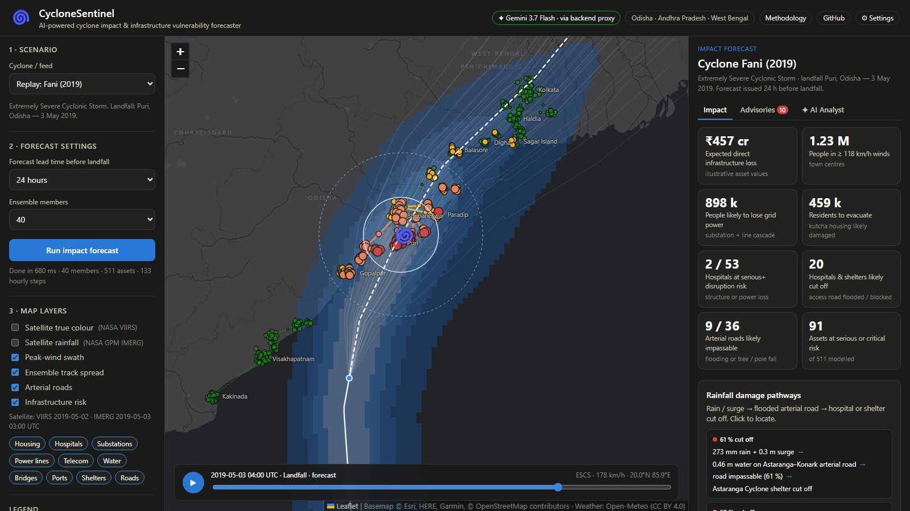
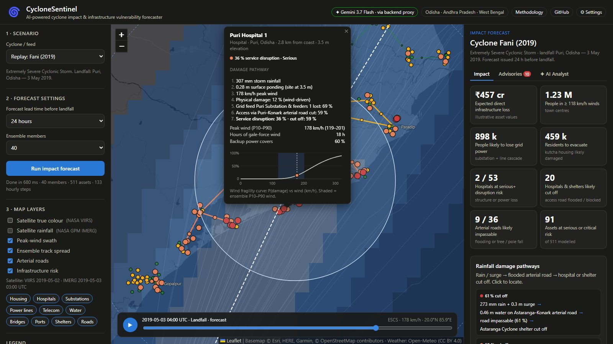
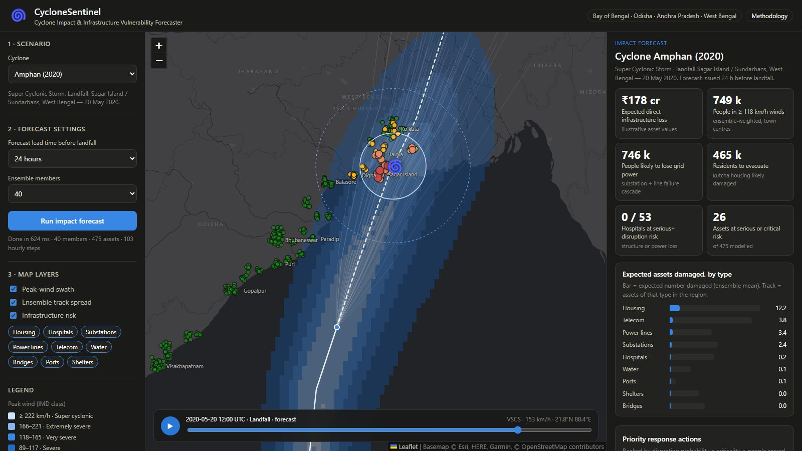

# 🌀 CycloneSentinel — Cyclone Impact & Infrastructure Vulnerability Forecaster

**Know which hospitals, substations, telecom towers and homes will fail before the cyclone makes landfall.**

A cyclone warning tells you *where the storm will go*. Disaster managers also need to know *what will
break*, and what fails next when the grid goes down. CycloneSentinel turns a cyclone track forecast into
asset-level damage and service-disruption probabilities, and then into a ranked list of response actions.
Everything runs in the browser in under a second.

**Live demo:** https://blop77.github.io/cyclone-sentinel/ · **Demo video:** _add link_ · **Deck:** [`docs/CycloneSentinel-deck.pdf`](docs/CycloneSentinel-deck.pdf)



## What it does

| | |
|---|---|
| 🌪️ **Hazard forecast** | Peak wind (Holland 1980 vortex with forward-motion asymmetry), storm surge (shelf-amplified parametric model) and rainfall flooding at every asset, hour by hour. |
| 🎲 **Uncertainty** | A 20–80 member Monte-Carlo track and intensity ensemble. The spread grows with forecast lead time (12–72 h), and every number is a probability, not a guess. |
| 🏗️ **Vulnerability** | Lognormal wind and flood **fragility curves** for 9 infrastructure classes: kutcha housing, hospitals, substations, power lines, telecom towers, water plants, bridges, ports and cyclone shelters. |
| ⚡ **Cascading failure** | A power-dependency graph. A hospital can survive the wind and still go dark when its feeder substation trips. The model captures this, net of on-site backup. |
| 📋 **Decision support** | KPIs (expected loss, people in ≥ 118 km/h winds, people losing power, evacuation need, hospitals at risk), plus auto-generated **priority actions** ranked by risk × criticality × people served. |
| 🗺️ **Scenarios** | Replay Fani (2019), Amphan (2020), Phailin (2013) and Hudhud (2014), or design a **what-if storm** by landfall point, intensity, heading and speed. |

<p>
  
  
</p>

## Hindcast validation

Each historical cyclone is replayed as a forecast issued 24 h before landfall (40 members):

| Cyclone | Actual landfall | Model's three worst-hit towns | People likely to lose power |
|---|---|---|---|
| Fani (2019) | Puri, Odisha | Puri, Bhubaneswar, Cuttack | 9.0 lakh |
| Amphan (2020) | Sundarbans, West Bengal | Sagar Island, Haldia, Kolkata | 7.5 lakh |
| Phailin (2013) | Gopalpur, Odisha | Berhampur, Gopalpur, Rambha | 3.6 lakh |
| Hudhud (2014) | Visakhapatnam, AP | Visakhapatnam, Vizianagaram, Bheemunipatnam | 15.3 lakh |

In every case the model puts the most risk in the district that was actually hit hardest. This is checked
automatically by `npm test`.

## Run it locally

No build step and no dependencies: it's plain HTML/JS with Leaflet from a CDN.

```bash
git clone https://github.com/Blop77/cyclone-sentinel.git
cd cyclone-sentinel
python -m http.server 8000        # or: npx serve
# open http://localhost:8000
```

Run the model tests (Node 18+):

```bash
npm test
```

Record the captioned, narrated demo video (Playwright + neural text-to-speech + ffmpeg):

```bash
pip install playwright edge-tts imageio-ffmpeg && python -m playwright install chromium
python scripts/record_demo.py                 # -> video/cyclonesentinel-demo.mp4
python scripts/record_demo.py --voice en-IN-PrabhatNeural   # different narrator
```

## Project structure

```
index.html            dashboard shell
css/style.css         dark, map-first UI
js/data.js            cyclone tracks, coastal towns, asset types + fragility parameters, asset generator
js/model.js           track interpolation, ensemble, wind/surge/rain, fragility, cascade, actions
js/app.js             Leaflet map, timeline playback, KPIs, charts, popups
tests/model.test.js   physics sanity checks + hindcast validation
scripts/record_demo.py  automated demo-video recorder with synced AI voice-over
docs/METHODOLOGY.md   equations, parameters, references, limitations
```

## How it works

```
track forecast ─► hourly track ─► 40-member ensemble
      ─► wind · surge · rain at each asset ─► fragility curves ─► P(damage)
      ─► power-dependency cascade ─► P(service disruption) ─► KPIs + ranked actions
```

The equations, parameters and references are in **[docs/METHODOLOGY.md](docs/METHODOLOGY.md)**.

## Data and honesty notes

* Cyclone tracks are approximate IMD best-track fixes, digitised for the demo.
* **The infrastructure inventory is synthetic.** Assets are generated deterministically around 34 real
  coastal towns (real names, approximate location, population, coast distance and elevation). They are
  not surveyed facility locations. Replacing them with OpenStreetMap, Bhuvan or discom data is the first
  production step.
* Fragility parameters are indicative (HAZUS-MH and post-event reports) and need local calibration.

## Roadmap

1. Ingest live IMD/JTWC advisories and ECMWF/NCMRWF ensembles automatically.
2. Load real assets from OpenStreetMap (`power=substation`, `amenity=hospital`, `man_made=mast`) and state GIS layers.
3. Use SRTM/Copernicus DEM and a real coastline for surge and flood inundation.
4. Calibrate fragility curves against Fani, Amphan, Hudhud, Biparjoy and Michaung damage assessments.
5. Push SMS and WhatsApp alerts to district control rooms, discoms and hospitals.

## Tech

Vanilla JavaScript · Leaflet · Esri dark basemap · Node test runner · Playwright (demo recording).
Hosted free on GitHub Pages.

## License

MIT
